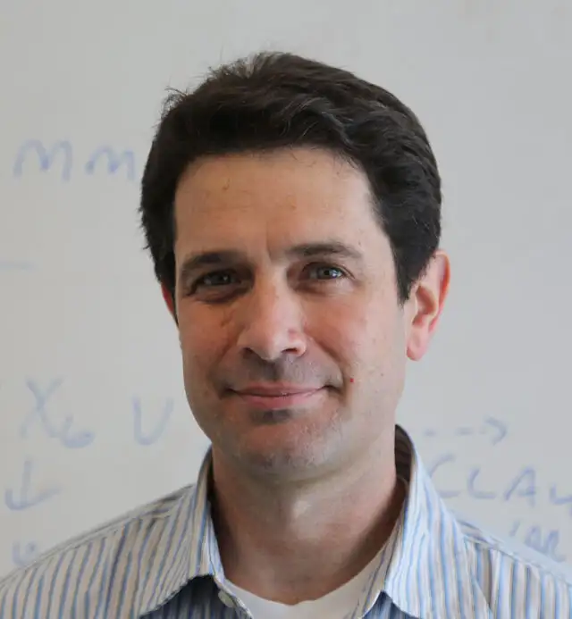
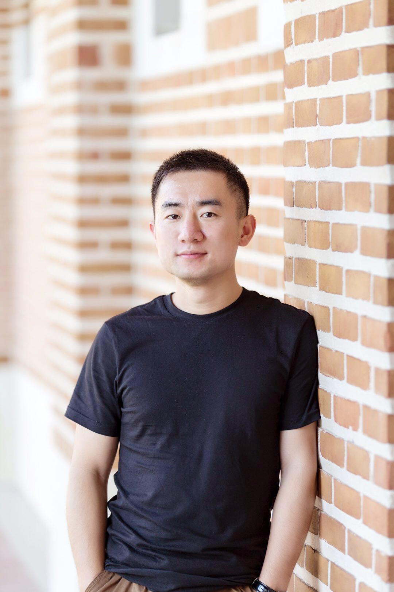

# Research On Algorithms & Data Structures (ROADS) to Mega-AI Models Workshop

## Workshop Summary

The state-of-the-art on numerous machine learning (ML) benchmarks comes from training enormous neural network models on expensive, specialized hardware with massive quantities of data. However, this route to success in deep learning is unsustainable. Training a large transformer model in natural language processing, for instance, can incur a higher carbon footprint than the [total lifetime cost of five cars](https://www.technologyreview.com/2019/06/06/239031/training-a-single-ai-model-can-emit-as-much-carbon-as-five-cars-in-their-lifetimes/). In addition, these massive models require immense memory and computing resources during deployment, which hinders their practical impact. To realize the full promise and benefits of artificial intelligence, we must solve these scalability challenges prevalent in both training and inference and design new algorithms with step-function improvements in efficiency. This workshop aims to bring together both computer science researchers and practitioners focused on ML efficiency to offer innovative solutions towards efficient modeling workflows grounded in principled algorithm design.

## Confirmed Speakers

* Jonathan Frankle (Harvard, USA)

* Micheal Mitzenmacher (Harvard, USA)

* Chen Luo (Amazon)

* Furong Huang (University of Maryland)

* Bilge Acun (Meta, USA)

## Schedule

* 8:30am-8:40am - Welcome and Opening Remarks (Workshop Organizers)
* 8:40am-9:40am - Keynote #1: Prof. Michael Mitzenmacher (Harvard)
* 9:40-10:05am - Invited Talk
* 10:05am - 10:30 am - Invited Talk
* 10:30-10:40 - Break
* 10:40am-11:40am - Keynote #2: Dr. Bilge Acun (Meta)
* 11:40-12:05pm - Invited Talk
* 12:05pm-12:30pm - Invited Talk
* 12:30pm-1:30pm - Lunch Break
* 1:30pm - 2:30pm - Keynote #3: Prof. Jonathan Frankle (Harvard)
* 2:30pm-3pm - Keynote #4: Prof. Furong Huang (UMD)
* 3:00pm-3:40pm - Keynote #5: Dr. Chen Luo (Amazon)
* 3:40-3:50pm - Break
* 3:50pm-4:30pm - Panel Discussion (Mitzenmacher, Frankle, Acun, Luo, Shrivastava)
* 4:30pm - Social

## Organizing Committee

* Zhaozhuo Xu (Rice University, USA)
* Aditya Desai (Rice University, USA)
* Vihan Lakshman (ThirdAI, USA)
* Anshumali Shrivastava (Rice University/ThirdAI, USA)

## Call for Papers

This workshop encourages submissions on original research, benchmarks, in-progress research results, and position papers. We also invite submissions of previously accepted papers where authors had limited presentation opportunities (e.g. due to pandemic-related constraints). We do not have strict requirements on paper lengths, but encourage authors to adhere to a maximum of **10-pages** (excluding references) in MLSys 2023 format. We will manage submissions through OpenReview, but the review-process will not be open.

## Scope

The technical topics of interest at this workshop include (but are not limited to):
* Algorithms and data structures to improve the computational efficiency of neural network training and inference
* Algorithmic solutions to the deployment challenges on resource-constrained devices 
* Model compression approaches for training and inference, including pruning, quantization, and parameter sharing
* Data reduction (sketching, sampling, coresets, etc. ) and active sampling approach for faster training
* Algorithmic techniques to enable longer sequence language models, higher resolution images for vision models, wider hidden layers, and other model architectures of interest to the community

## Submission

[OpenReview Link](https://openreview.net/group?id=MLSys.org/2023/Workshop/ROADS)

Please format submissions using the MLSys 2023 style files.

The reviewing process will be double-blind. Please submit anonymized papers that omit all information about author identities. There are no formal proceedings generated from this workshop. Accepted papers will be made available on OpenReview.

## Contact

Contact the organizers: zx22@rice.edu
